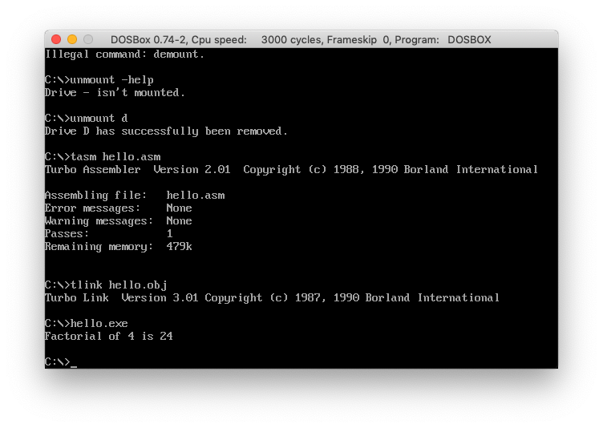

### CECS524. Lab9
# Creating an Assembly Language Program

## Goal
1. Setting up the environment to test assembly codes.
2. Running a simple assembly program.

## Lab Assignment
- [ ] Install TurboGUI (from sourceforge).  
*TurboGUI has both assembler IDE and TASM that runs on Dos.*
- [x] Download pcmac.inc (macro codes).
- [x] Create an assembly file from the given code. (hello.asm)
- [x] Put the source code file and pcmac.inc under the same directory.  
- [x] Assembly hello.asm (-> hello.obj)
- [x] Build hello.obj (-> hello.exe)
- [x] Run hello.exe

## Assembler with virtual DOS for Mac
Since I use Mac, not Windows, I needed to install DOS first.  
Needed the TurboAssembler(TASM) or whatever assemblers and just a simple editor to write the code.  


## How I did (on MacOS X)

1. Install [DOSBox](https://www.dosbox.com/download.php?main=1).  
DOSBox is virtual DOS machine.

2. Install an assembler. I’ll use TASM.  
Download DOSBox(MAC).zip and unzip it under the home directory /Users/user_name/ (or ~/)

3. Mount a local directory as a virtual DOS drive.  
You can do this by editing preferences for the lasting change or simply by mounting it on the command line temporarily

3-1. To mount permanently,  
Add the code below under [autoexec] section of the DOSBox Preferences file(~/Library/Preferences/DOSBox 0.73-2 Preferences)
```
@ECHO OFF
MOUNT C ~/DOSBox/
c:
UTILS\init.BAT
```
The local directory ‘~/DOSBox/‘ is mounted as a virtual drive C and the DOS’s current drive is switched to drive C.

3-2. To mount temporarily,  
On the command line . 
```
Mount c ~/DOSBox/
C:
```
This works only for the session

4. Use ‘dir’ to see if you mounted right directory by checking what’s in the directory.  
This location is where all .asm, .obj, .exe files will be.

5. Create an assembly code on whatever editor I want to use, and save the file with ‘.asm’ extension (e.g. hello.asm)

6. Put PCMAC(pcmac.inc) in the same directory where hello.asm is located.  
This is a macro file, to use the macro from hello.asm, of course this should be in same folder.

7. Assembly, Build, and Run using TASM.  
On the Dos command line…
```
TASM hello.asm
```
TASM assemblies, so this generates an object file.
```
TLINK hello.obj
```
TLINK links object files(if there’s more than one obj files) and builds, so this generates an executable file.
```
hello.exe
```
This run the execution file.  
  

8. Whatever change for the assembly code, edit hello.asm and repeat the step 7 as you normally would program.

9. Regular DOS commands work in the same way.  
To exit the DOS, type ‘exit’ and enter/return.  
For more commands, type ‘help’.

## Editor I use
I chose [Atom](https://atom.io/) with [Language-X86-64-Assembly](https://atom.io/packages/language-x86-64-assembly) package plugged in.  
Works great and looks great:sparkles:  
