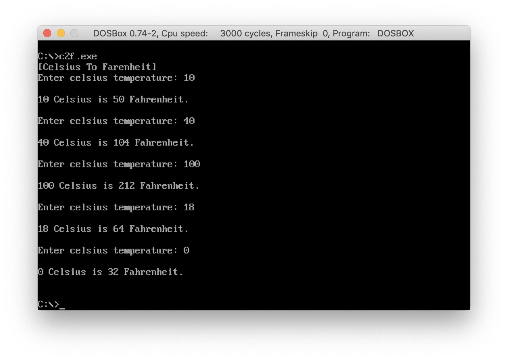

### CECS524. Lab12. Subprogram
# Celsius to Fahrenheit Program
- assembly code: [C2F.asm](../C2F.asm)
- executable: C2F.exe

#### Screenshot  


## Assignment

#### CECS524 Lab12. Subprogram
Implement the C program below as IBM PC assembly language.  
The variables in main and c2f and the parameter to c2f must be stack dynamic variables.  
DO NOT PASS PARAMETERS IN REGISTERS.  
Do not make variables in the data segment.   Strings can be created in the data segment.
```
#include <stdio.h>

int c2f(int cel){
	return (cel * 9 / 5) + 32;
}

int main(){
	int celsius;
	do {
		printf("Enter celsius temperature:");
		scanf("%d", &celsius);

		printf("%d Celsius is %d Fahrenheit\n", celsius, c2f(celsius));
	}
	while(celsius !=0);

	return 0;
}
```
Like Lab11, copy PutDec and GetDec into your assembler program.
