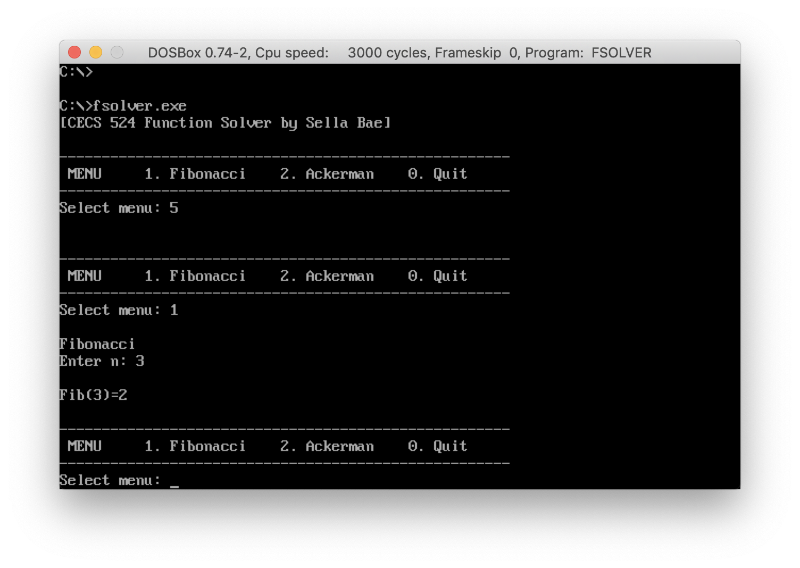
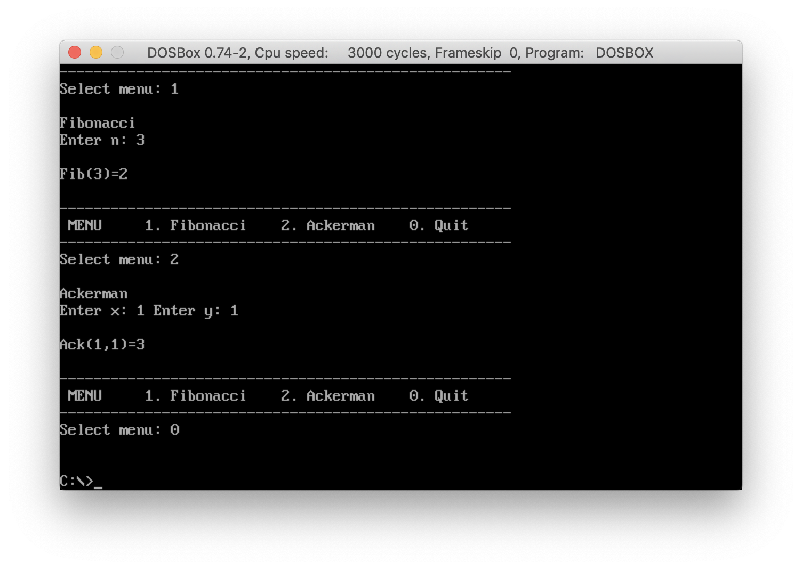

### CECS524. Spring break project
# Function Solver: Fibonacci and Ackerman

Assignment: [Function Solver](#Assignment)  
Assembly code: [FSolver.asm](../FSolver.asm)  

Screenshots  



## Assignment

**CECS 524  Function Solver**  
Write an IBMPC assembly language program to do the following:
- Solve the [Fibonacci](http://www.nist.gov/dads/HTML/fibonacciNumber.html) number series.
- Solve [Ackerman](http://www.nist.gov/dads/HTML/ackermann.html)'s function.

#### C++ sketch of the program:
```
int	Fibonacci(int n);
int	Ackerman(int x, int y);
void	input() {
	int	x, y;

	//get input from user
	//call the appropriate function
	//display the appropriate answer
}

int main() {
	//call input
}
```

#### Restrictions:
- There are NO global variables. No variables are defined in the data segment except strings necessary for the prompts.
- THERE IS TO BE NO I/O within Ackerman and Fibonacci. All I/O is in a procedure called input.
- All local storage, including parameters and local variables must be on the stack.
- All functions that return a value must do so in the AX register.
- Registers may not be used for parameter passing or local storage (only temporary storage).
- The Ackerman function is recursive. Recursion must be used in the assembler program.
- You may place the code for PutDec and GetDec directly in your program.

#### Sample input:
```
1. Fibonaaci
2. Ackerman
0. Quit
Enter choice:1
Enter n:3
Fib(3)=2
```
```
1. Fibonaaci
2. Ackerman
0. Quit
Enter choice:2
Enter x:1
Enter y:1
Ack(1,1)=3
```
```
1. Fibonaaci
2. Ackerman
0. Quit
Enter choice:0
```

#### Ackerman function test sets
```
x	y	 Ack(x,y)
0	0	 1
0	1  2
0	8  9
1	4	 6
2	1	 5
2	9	 21
3	8	 2045
4	0	 13
```
#### Fibonacci test sets
```
n  Fib(n)
1  1
2  1
3  2
4  3
5  5
6  8
10 55
12 144
16 987
```
