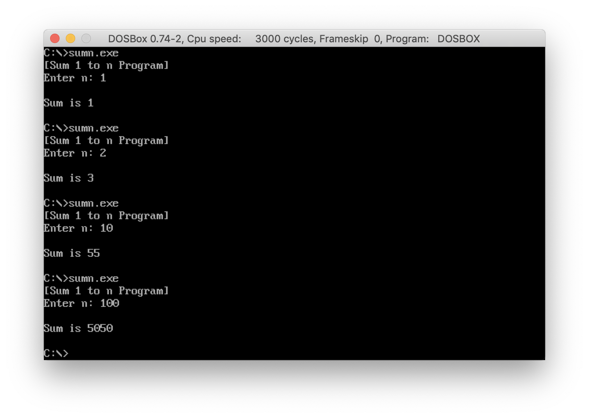

### CECS524. Lab13. Recursive Assembler Function
# Sum 1 to n Program
IBM PC Assembly language program that adds a sequence of integers from 1 to an input value by recursive calls

#### Assembly code
[SumN.asm](../SumN.asm)  

#### Screenshot  


## Assignment
#### CECS524 Lab13. Recursive Assembler Function  
Write an IBM PC assembly language version of the java program below:
```
package cecs524lab13;
import java.util.Scanner;
public class CECS524Lab13 {
    private static int recadd(int n){
        if(n==1)
            return 1;
        else
            return n + recadd(n-1);     
    }
    public static void main(String[] args) {
        Scanner sc = new Scanner(System.in);

        System.out.println
             ("This program adds a sequence of integers from n to 1");
        System.out.print("Enter a number:");
        int     n = sc.nextInt();
        System.out.println("Sum is " + recadd(n));
    }
}
```
recadd is a recursive summation function.
