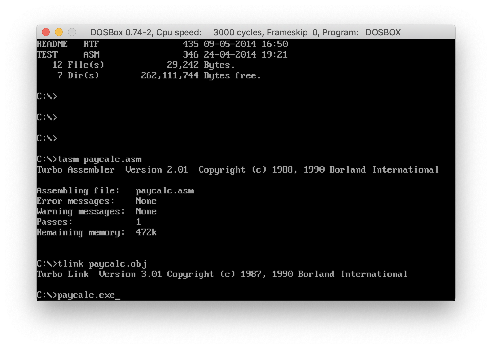

### CECS524. Lab11
# Pay Calculator
IBM PC Assembly language program that calculates wages

Assignment: [Lab11](#Assignment)  

Assembly code: [PayCalc.asm](../PayCalc.asm)  

Screenshots  
  
  

## Assignment
Lab 11	CECS 524	Spring 2019		Assembler Math  
DUE: end of lab

#### Objectives:  
* use of include files
* use of I/O macros
* numeric I/O
* use of library files and procedures
* integer arithmetic operations

Formatting and comments are to follow the example on the back of this page.

#### Assignment Details:
This assignment consists of writing an IBM PC Assembly language program calculates wages. The wages are subject to 12% flat tax on any and all amounts of gross pay. Medical insurance payments may also be deducted if desired.

Three integer inputs are required to be entered, and then the program should produce the gross pay (hours * rate), the tax (gross pay * 12%), and net pay (gross – tax –insurance). Round off errors may occur since the numerical values are integers and the program performs division

The entry procedure should be called MAIN. Output will look exactly like this:
```
CECS 524 Pay Calculator.

Enter hours worked:40
Enter rate of pay:10
Enter insurance deduction:50

Gross pay:400
Tax:48
Insurance:50
Net pay:302
```

A second example:
```
CECS 524 Pay Calculator.

Enter hours worked:23
Enter rate of pay:13
Enter insurance deduction:25

Gross pay:299
Tax:35
Insurance:25
Net pay:239
```

#### Formatting and Comments:
1. Every procedure (except main) shall have a comment header describing the purpose of the function, its interface (parameters whether passed in registers or on the stack, and its return value.
2. Every instruction except RET shall have a comment starting at column 35. Pseudo-ops such as PROC, ENDP, .DATA, and so on do not require comments.
3. Instruction and segment formats are as follows:
   1. Program segments pseudo-ops are to start in column 10.
   2. All instructions are also to start in column 10.
   3. Procedure pseudo-ops start in column 1.
   4. Operands start in column 20.
   5. Comments on instructions begin in column 35. If an instruction’s length exceeds 35, then its comment starts one space immediately after the end of the instruction.
4. All instructions and pseudo-ops are to be in all caps. Ex. ADD, PROC.
5. All register references are to be in all caps. Ex. AX, DS, BP.
6. All user defined identifiers are to have first letter capitalized and following letters in lower case. Use meaningful names. Names that convey a meaning of more than one word (Ex. RateOfPay) should capitalize each word.

A small sample follows. The numbers are for column reference only. Do not include them in your code.
```
1234567890123456789012345678901234567890
         1111111111222222222233333333334
;Purpose: Procedure CalcSum sums the values of AX, BX, and MyVar
;Parameters: AX = accumulated sum, BX = second input, MyVar = third input
;Returns: AX
;
CalcSumSum  PROC
         ADD       AX, BX         ;AX = AX + BX. BX contains second input
         ADD       AX, MyVar      ;AX = AX + MyVar. MyVar contains third input
         RET
CalcSum     ENDP
```
